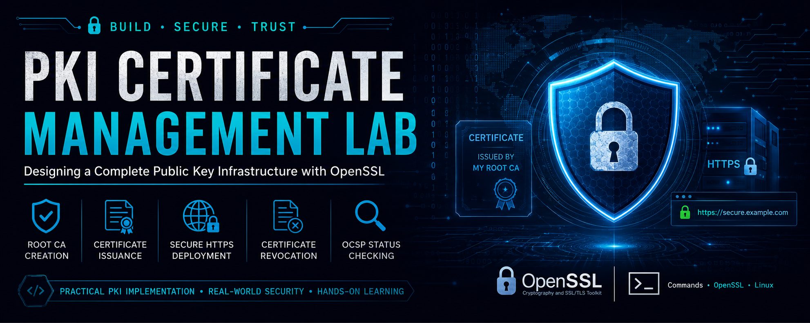

# 🔐 Lab 5 — Public Key Infrastructure (PKI) and Certificate Management



## 📚 Course
**Advanced Cryptography (CYBE6229)**

## 🧠 Difficulty Level
**Advanced**

---

# 🚀 Overview

This lab demonstrates the complete deployment of a Private Key Infrastructure (PKI) environment using OpenSSL, Apache2, Kali Linux, and Ubuntu Server.

The project walks through the real-world process of:

- Building a private Root Certificate Authority (CA)
- Issuing and signing SSL/TLS certificates
- Configuring HTTPS on Apache
- Installing trust chains on Linux and Firefox
- Testing secure connections with curl and browsers
- Implementing Certificate Revocation Lists (CRL)
- Exploring OCSP-based revocation mechanisms

This is the same foundational technology used by:
- banking systems
- enterprise VPNs
- HTTPS websites
- cloud platforms
- zero trust architectures
- secure internal infrastructures

---

# 🏗️ Lab Environment

| Component | Purpose |
|---|---|
| Kali Linux 2025.4 | Client Machine |
| Ubuntu Server 24.04 | Certificate Authority + Web Server |
| OpenSSL 3.x | PKI and Certificate Management |
| Apache2 | HTTPS Web Server |
| Firefox | Certificate Validation |
| VirtualBox | Virtualization Platform |

---

# 🎯 Objectives

✔️ Deploy a Private Root Certificate Authority  
✔️ Generate and sign server certificates  
✔️ Configure HTTPS using Apache SSL/TLS  
✔️ Install trusted CA certificates on clients  
✔️ Validate TLS communication  
✔️ Implement CRL-based certificate revocation  
✔️ Explore OCSP certificate validation  

---

# 🧩 Project Structure

```text
lab5-pki-certificate-management/
├── certificates/
│   ├── ca.crl
│   ├── ca.crt
│   ├── ocsp.crt
│   └── webserver.crt
│
├── commands/
│
├── configs/
│   ├── ca.cnf
│   └── webserver.cnf
│
├── reports/
│   └── lab5_report.md
│
└── screenshots/
```

---

# 🛡️ Security Concepts Demonstrated

- Public Key Infrastructure (PKI)
- Certificate Authority (CA)
- SSL/TLS Encryption
- X.509 Certificates
- Certificate Signing Requests (CSR)
- Certificate Revocation Lists (CRL)
- Online Certificate Status Protocol (OCSP)
- HTTPS Hardening
- Trust Chains
- Secure Certificate Validation

---

# 🧪 Skills Demonstrated

This project demonstrates practical skills in:

- Linux system administration
- OpenSSL certificate management
- Apache SSL configuration
- HTTPS troubleshooting
- Secure key management
- Network security validation
- Cryptographic trust models
- Security infrastructure deployment

---

# 🌐 Lab Architecture

```text
Kali Linux Client
        │
        │ HTTPS (TLS)
        ▼
Ubuntu Apache Web Server
        │
        ▼
Private Root Certificate Authority
```

---

# 📸 Included Evidence

This repository includes:

- PKI configuration files
- SSL certificate files
- Certificate revocation examples
- Full technical report
- HTTPS validation screenshots
- OpenSSL configurations
- TLS testing outputs

---

# ⚠️ Educational Use Only

This project was developed strictly for:

- cybersecurity education
- cryptography training
- laboratory experimentation
- defensive security learning

Do NOT use these techniques against systems you do not own or have explicit authorization to test.

Unauthorized use may violate:
- organizational policies
- cybersecurity laws
- ethical guidelines

---

# 📖 Key Lessons Learned

- Proper certificate management is critical to secure communications
- Trust chains depend entirely on CA integrity
- Subject Alternative Names (SANs) are essential in modern TLS
- Revocation mechanisms are often overlooked but extremely important
- Secure key storage is the backbone of PKI security

---

# 🔥 Future Improvements

- OCSP responder deployment
- HSTS enforcement
- TLS 1.3 hardening
- Intermediate CA architecture
- Automated certificate renewal
- Certificate transparency logging
- Dockerized PKI environment

---

# 👨‍💻 Author

**Tchoffouo Djimyr Hassan**

Advanced Cryptography Laboratory Series  
CYBE6229

---

# ⭐ Inspiration

PKI powers the modern internet.

Every secure website, VPN tunnel, banking session, cloud connection, and enterprise authentication system relies on these exact cryptographic trust mechanisms.

Understanding PKI is one of the most valuable skills in cybersecurity.

If you want to understand how HTTPS really works under the hood — this lab is the perfect place to start.

---
